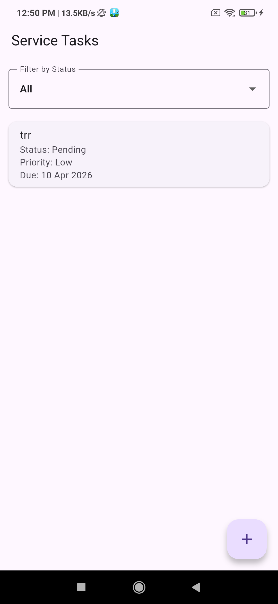

# Enterprise Field Service Tracker

A Flutter mobile application that allows field agents to manage service tasks.

## Features

- Task list
- Task details
- Update task status
- Add new task 
- Riverpod state management
- GitHub CI workflow

## Setup

flutter pub get
flutter run

## State Management

Riverpod was chosen for better separation of concerns, compile-time safety, and improved testability.
 
## 📱 App Screenshots

### Task List Screen

### Task Detail Screen

### Add Task Screen

// Application video

// Apk file
